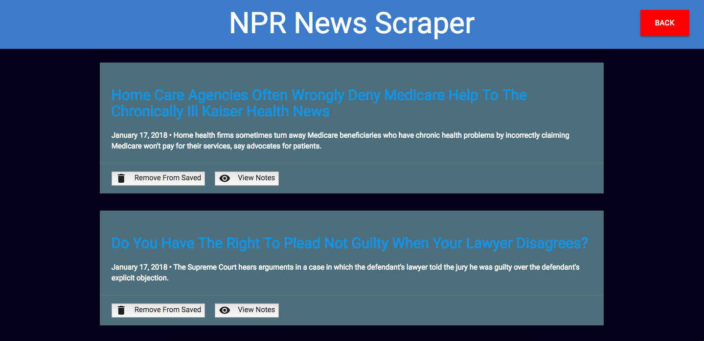
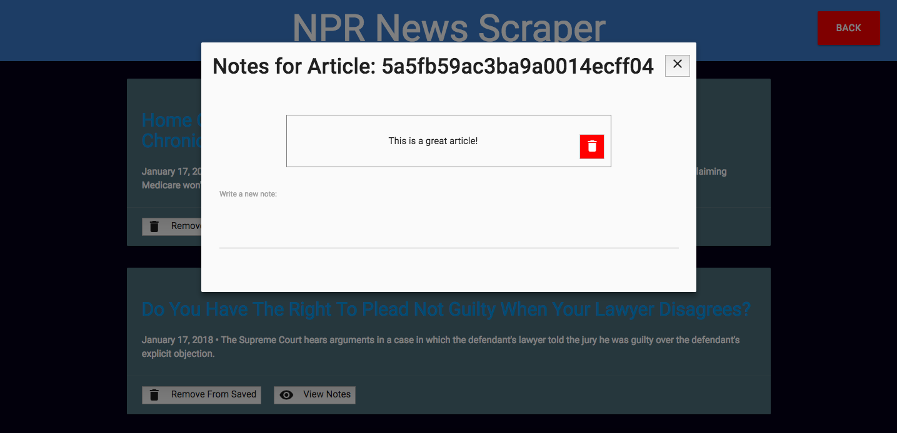

# News-Scraper

This is a news article scraping app! It goes to NPR's articles page and grabs the title, description, and link to every article and displays it on my page. From there, you can save articles, which takes you to a saved articles page where you can delete or add notes to specific articles you read for everyone to see, or you can unsave the article.

## Technologies Used:

- Materialize
- Cheerio
- Request
- Express
- MongoDB

## How it looks:

#### Home Page

#### Saved Articles

#### Notes Modal

